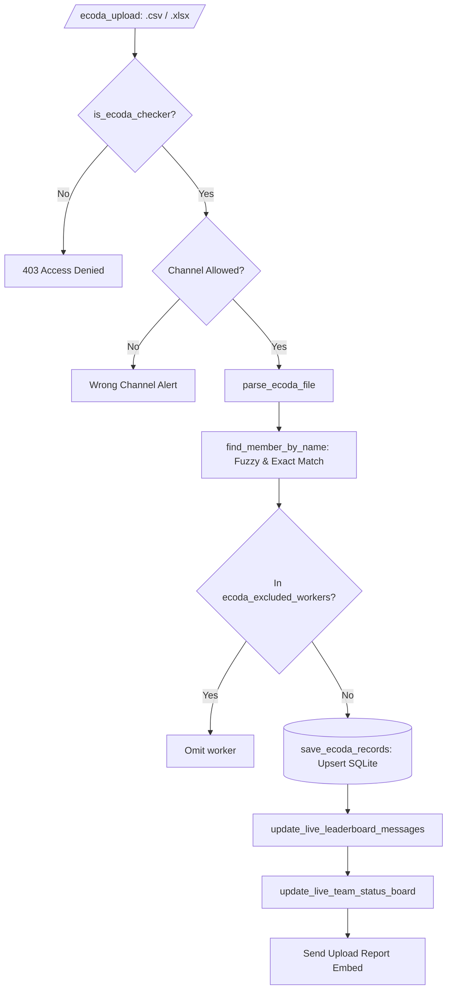

# 💼 Cog Documentation: `EcodaCog` (`cogs/ecoda.py`)

## 📌 Overview
The `EcodaCog` cog is the workforce production management suite of the bot. It ingests daily work hour sheets from production portals (e.g. ECODA), handles manual adjustments, maps rows to Discord members, filters blacklisted/external workers, manages team rosters with dynamic autocomplete dropdowns, and renders daily team upload status boards.

---

## 🏗️ Architecture & Processing Pipeline

---

## ⚡ Slash Commands Reference

### 1. File Ingestion & Manual Adjustments

#### `/ecoda_upload`
* **Description:** Upload daily ECODA work hours sheet (`.csv` or `.xlsx`).
* **Access Level:** Checker / Team Leader / Administrator ([`is_ecoda_checker`](file:///d:/Projects/Discord-Time-Counter-Bot/utils.py#L781)).
* **Channel Restriction:** Enforces `ecoda_upload_channel_id` if configured via `/ecoda_set_channel`.
* **Parameters:**
  * `file` *(Required, `discord.Attachment`)*: `.csv` or `.xlsx` spreadsheet.
  * `team` *(Optional, Autocomplete)*: Dynamic autocomplete dropdown populated from registered teams in `ecoda_teams`.
  * `date` *(Optional, `str`)*: Date in `YYYY-MM-DD` (defaults to today).
* **Processing:**
  * Uses [`parse_ecoda_file`](file:///d:/Projects/Discord-Time-Counter-Bot/utils.py#L855) to auto-detect headers (`work_time`, `user_name`, `default_role`, `team_name`).
  * Resolves worker names against server members using exact match, display name, and case-insensitive fallback.
  * Automatically updates the Live Leaderboard and Live Team Status boards.

#### `/ecoda_add`
* **Description:** Manually add work hours for a worker.
* **Access Level:** Checker / Team Leader / Administrator.
* **Parameters:** `worker`, `hours`, `role` (0: Labeler, 1: Checker), `team` (autocomplete dropdown), `date`.
* **Interactive Date Picker:** If `date` is omitted, prompts with [`CalendarDatePickerView`](file:///d:/Projects/Discord-Time-Counter-Bot/cogs/ecoda.py#L425).

#### `/ecoda_edit`
* **Description:** Correct hours or update team assignment for an existing worker record on a specific date.
* **Parameters:** `worker`, `hours`, `team` (autocomplete dropdown), `date`, `note`.

#### `/ecoda_delete` & `/ecoda_delete_date`
* **`/ecoda_delete`:** Deletes records for one or multiple comma-separated workers for a date or `'all'`.
* **`/ecoda_delete_date`:** Wipes all worker records for an entire specific date (e.g. replacing a corrupt sheet).

---

### 2. Team Roster & Upload Status Monitoring

#### `/ecoda_team` (Command Group — Server Administrator Only)
* **Default Permissions:** `@app_commands.default_permissions(administrator=True)` + explicit check on `guild_permissions.administrator`.
* **Subcommands:**
  * `/ecoda_team add name:<str>` — Adds a new team to the active roster.
  * `/ecoda_team remove name:<str>` — Marks a team as inactive (features autocomplete dropdown).
  * `/ecoda_team list` — Displays all registered teams, active status, worker counts, and last upload date.

#### `/ecoda_team_status`
* **Description:** Displays an interactive daily team upload status dashboard.
* **Access Level:** Checker / Team Leader / Administrator.
* **Parameters:** `date` *(Optional, `YYYY-MM-DD`, defaults to today)*.
* **Dashboard Elements:**
  * Progress Bar: `🟩🟩🟩🟩🟩🟩⬜⬜⬜⬜ 60%`
  * Metrics: `✅ 6 Uploaded • ❌ 4 Pending (Total: 10 Teams)`
  * 🟢 Uploaded details: Team name, uploader mention, total workers, total work hours, timestamp.
  * 🔴 Pending alerts: Missing teams awaiting upload.
  * Navigation Controls: `[ ◀️ Prev Day ]`, `[ 📅 Date ]`, `[ Next Day ▶️ ]`, `[ 📅 Today ]`, `[ 🔄 Refresh ]`.

---

### 3. Administrative Configuration & Maintenance

#### `/ecoda_set_role` & `/ecoda_set_channel`
* **`/ecoda_set_role role:<role>`:** Dynamically designates which Discord role counts as authorized Checker/Team Leader.
* **`/ecoda_set_channel channel:<channel>`:** Restricts `/ecoda_upload` invocations to a specific channel.

#### `/ecoda_exclude`
* **Description:** Blacklists external vendors or excluded workers from appearing on leaderboards and reports without deleting raw data.
* **Actions:** `Add to Excluded List` or `Remove from Excluded List`.

#### `/ecoda_reset`
* **Description:** Completely wipes all worker records from the `ecoda_records` table to prepare for a new billing cycle.
* **Safety Guardrail:** Requires a 2-step confirmation modal.
* **Isolation:** Voice tracking activity (`voice_activity`) and bot settings (`bot_settings`) remain 100% untouched.

#### `/ecoda_leaderboard`
* **Description:** Interactive on-demand ECODA leaderboard command with timeframe filters, role toggles, active/inactive filters, and pagination.
