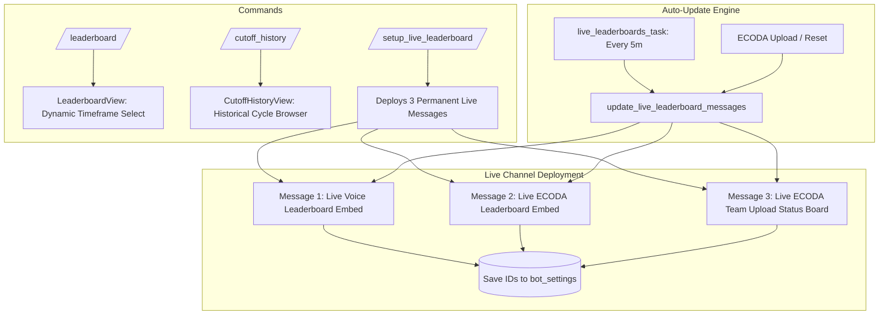

# 🏆 Cog Documentation: `LeaderboardCog` (`cogs/leaderboard.py`)

## 📌 Overview
The `LeaderboardCog` cog manages ranking, cutoff tracking, historical cycle inspection, and permanent self-updating live leaderboard channels. It synchronizes both **Voice Activity** and **ECODA Work Hours** across standardized payroll cutoff cycles (1st–15th and 16th–End of Month).

---

## 🏗️ Architecture & Component Flow

---

## 📅 Cutoff Cycle Engine
Organizations and BPO operations run payroll on strict cutoffs:
* **Part 1 (1st Cutoff):** From Day 1 to Day 15 of the month (`YYYY-MM-01` to `YYYY-MM-15`).
* **Part 2 (2nd Cutoff):** From Day 16 to the last day of the month (`YYYY-MM-16` to `YYYY-MM-28..31`).
* Handled dynamically by [`get_cutoff_dates(mode)`](file:///d:/Projects/Discord-Time-Counter-Bot/utils.py#L182) and [`get_specific_cutoff_range(part, month, year)`](file:///d:/Projects/Discord-Time-Counter-Bot/utils.py#L210).

---

## ⚡ Slash Commands

### 1. `/setup_live_leaderboard`
* **Description:** Deploys permanent, self-updating Voice, ECODA, and Team Upload Status boards with interactive buttons into a dedicated channel.
* **Access Level:** Server Administrator only (`@app_commands.default_permissions(administrator=True)`).
* **Parameters:**
  * `channel` *(Required, `discord.TextChannel`)*: Target read-only channel (e.g. `#live-leaderboard`).
* **Actions:**
  1. Posts and pins **Message 1**: Live Voice Activity Leaderboard ([`LiveVoiceLeaderboardView`](file:///d:/Projects/Discord-Time-Counter-Bot/utils.py#L1418)).
  2. Posts and pins **Message 2**: Live ECODA Work Hours Leaderboard ([`LiveEcodaLeaderboardView`](file:///d:/Projects/Discord-Time-Counter-Bot/utils.py#L1468)).
  3. Posts and pins **Message 3**: Live ECODA Team Upload Status Board ([`LiveTeamUploadStatusView`](file:///d:/Projects/Discord-Time-Counter-Bot/utils.py#L1965)).
  4. Stores channel ID and message IDs in `bot_settings`:
     * `live_leaderboard_channel_id`
     * `live_voice_msg_id`
     * `live_ecoda_msg_id`
     * `live_status_msg_id`

### 2. `/cutoff_history`
* **Description:** Browse any past or present cutoff leaderboard with pagination support.
* **Access Level:** Everyone.
* **Parameters:**
  * `category` *(Required, Choice)*: `🔊 Voice Activity Leaderboard` or `💼 ECODA Work Hours Leaderboard`.
  * `part` *(Required, Choice)*: `1st Cutoff (1st - 15th)` or `2nd Cutoff (16th - End of Month)`.
  * `month` *(Optional, Integer)*: Month number (`1` to `12`, defaults to current).
  * `year` *(Optional, Integer)*: Four-digit year (defaults to current).

### 3. `/leaderboard`
* **Description:** Displays interactive voice activity leaderboard with dropdown timeframe selectors (Current Cutoff, Previous Cutoff, Today, This Week, This Month, All Time).
* **Access Level:** Everyone.

---

## 🔄 Background Refresh Task (`live_leaderboards_task`)
* **Interval:** Runs every 5 minutes (`@tasks.loop(minutes=5)`).
* **Behavior:** Calls [`update_live_leaderboard_messages(bot)`](file:///d:/Projects/Discord-Time-Counter-Bot/utils.py#L2070), which in turn fetches latest activity from SQLite and updates all 3 persistent messages in-place without generating chat notification noise.
