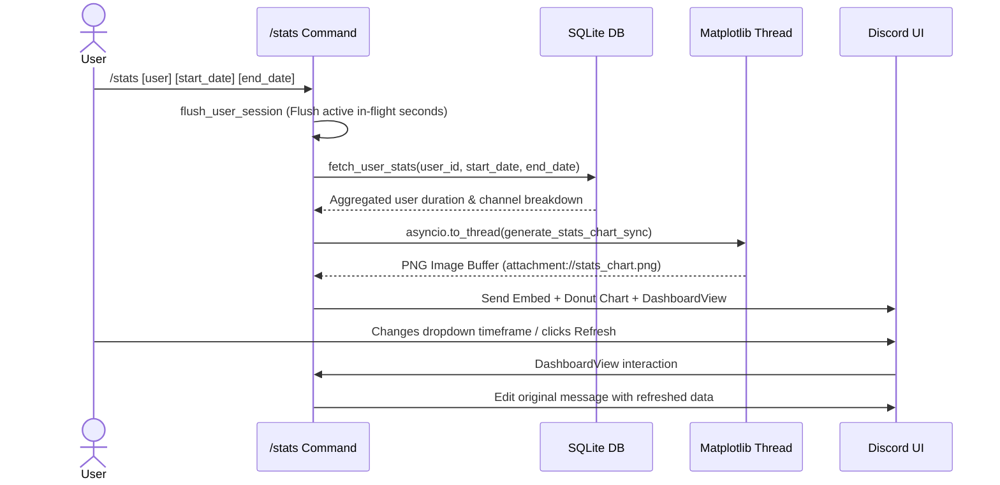

# 📊 Cog Documentation: `StatsCog` (`cogs/stats.py`)

## 📌 Overview
The `StatsCog` cog powers the **`/stats`** command, providing an interactive, visual, and user-friendly personal analytics dashboard for any server member. It computes total voice activity, audio state breakdowns (unmuted vs. muted vs. deafened), channel distributions, and dynamically renders graphical charts via `matplotlib`.

---

## 🏗️ Architecture & Interaction Flow

---

## ⚡ Slash Command Specification

### `/stats`
* **Description:** View interactive voice activity dashboard for yourself or another user.
* **Access Level:** Available to all members (can be locked to `STATS_CHANNEL_ID` via `.env`).
* **Parameters:**
  * `user` *(Optional, `discord.Member`)*: Target user. If omitted, defaults to command caller (`interaction.user`).
  * `start_date` *(Optional, `str`)*: Custom range start date in `YYYY-MM-DD` format (e.g. `2026-09-01`).
  * `end_date` *(Optional, `str`)*: Custom range end date in `YYYY-MM-DD` format (e.g. `2026-09-15`).

---

## 🎛️ Interactive UI Component: `DashboardView`

### 1. Timeframe Select Menu (`discord.ui.Select`)
Users can switch aggregation periods in real-time without re-running the command:
* `☀️ Today` (`today`): Current day in `LOCAL_TZ`.
* `📅 This Week` (`this_week`): Monday to Sunday of the current week.
* `🟢 This Month` (`this_month`): Default period. 1st to last day of current month.
* `🟡 Last Month` (`last_month`): Full preceding calendar month.
* `📆 This Year` (`this_year`): January 1st to December 31st of current year.
* `🔵 All Time` (`all_time`): Cumulative stats across all recorded history.

### 2. Refresh Button (`discord.ui.Button`)
* **Emoji / Style:** `🔄` / `ButtonStyle.primary`.
* **Action:** Flushes any active in-memory session segment (`flush_user_session`) and re-queries the database to show real-time live minutes up to the current second.

---

## 📈 Chart Rendering (`generate_stats_chart_sync`)
* Rendered in a non-blocking thread via [`asyncio.to_thread`](file:///d:/Projects/Discord-Time-Counter-Bot/cogs/stats.py#L79) using Matplotlib's non-interactive `Agg` backend:
  1. **Donut Chart:** Visual breakdown of Unmuted (🟢 Green), Muted (🟡 Yellow), and Deafened (🔴 Red) percentages.
  2. **Horizontal Bar Chart:** Top 5 voice channels ranked by total time spent.

---

## 🛠️ Diagnostics & Gotchas
1. **Thread Safety:** Chart creation runs in a worker thread (`asyncio.to_thread`) to prevent blocking Discord.py's asyncio event loop during image encoding.
2. **Date Reversal:** If `start_date > end_date` is supplied, the cog automatically swaps them so queries remain valid.
