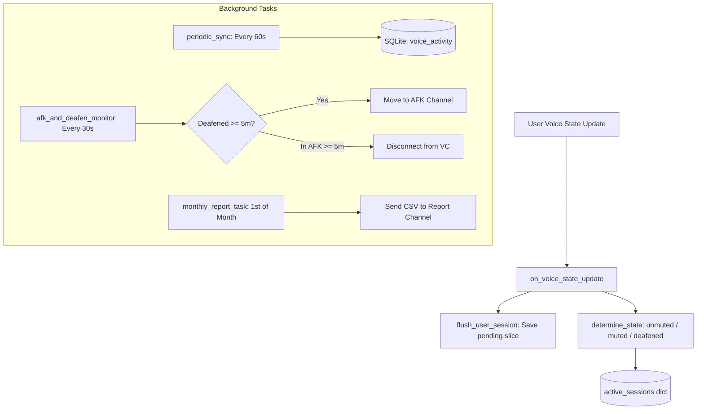

# 🎙️ Cog Documentation: `VoiceTracking` (`cogs/voice_tracking.py`)

## 📌 Overview
The `VoiceTracking` cog is the core real-time telemetry engine of **Discord Time Counter Bot**. It monitors all guild voice channels, tracks member audio states (unmuted, muted, deafened), manages in-memory sessions, flushes activity to SQLite, enforces AFK/deafen movement policies, and schedules automated monthly reports.

---

## 🏗️ Architecture & Component Relationships

---

## ⚙️ Background Tasks

### 1. `periodic_sync` (`@tasks.loop(seconds=60)`)
* **Interval:** Runs every 60 seconds.
* **Purpose:** Calls [`sync_all_sessions()`](file:///d:/Projects/Discord-Time-Counter-Bot/utils.py#L392) to write in-memory duration delta from [`active_sessions`](file:///d:/Projects/Discord-Time-Counter-Bot/utils.py#L75) into the `voice_activity` SQLite database.
* **Resilience:** Ensures that if the bot process or host crashes, at most 60 seconds of voice time can be lost.

### 2. `monthly_report_task` (`@tasks.loop(time=dt_time(hour=0, minute=0, tzinfo=LOCAL_TZ))`)
* **Trigger:** Daily at midnight (00:00 AM) in `LOCAL_TZ` (`Asia/Dhaka`).
* **Condition:** Checks if `now_local.day == 1`.
* **Action:** If `REPORT_CHANNEL_ID` is configured in `.env`, triggers [`generate_and_send_csv(channel, "last_month")`](file:///d:/Projects/Discord-Time-Counter-Bot/utils.py#L650) to export and post the complete payroll/attendance CSV for the preceding month.

### 3. `afk_and_deafen_monitor` (`@tasks.loop(seconds=30)`)
* **Interval:** Runs every 30 seconds across all voice-connected members.
* **Rules & Policies:**
  1. **Deafen-to-AFK:** If a user remains server-deafened or self-deafened continuously for **$\ge 300$ seconds (5 minutes)**, the bot moves them to `AFK_CHANNEL_ID` (or disconnects them if no AFK channel is set).
  2. **AFK Auto-Kick:** If a user stays inside the designated AFK channel for **$\ge 300$ seconds (5 minutes)**, the bot disconnects (`move_to(None)`) them from voice entirely.

---

## 🎧 Event Handlers

### `on_voice_state_update(member, before, after)`
Triggers on any voice channel action:
1. **Bot Check:** Ignores bots (`if member.bot: return`).
2. **Session Flusher:** If the member already has an open session in [`active_sessions`](file:///d:/Projects/Discord-Time-Counter-Bot/utils.py#L75), calls [`flush_user_session(member.id)`](file:///d:/Projects/Discord-Time-Counter-Bot/utils.py#L353) to attribute their elapsed seconds up to `now` before switching channel/state.
3. **State Classification ([`determine_state(voice_state)`](file:///d:/Projects/Discord-Time-Counter-Bot/utils.py#L240)):**
   * `deafened`: If `voice_state.self_deaf` or `voice_state.deaf`.
   * `muted`: If `voice_state.self_mute` or `voice_state.mute` (and not deafened).
   * `unmuted`: If actively streaming/speaking with mic enabled.
4. **Channel Join or Switch (`if after.channel`):**
   * Records `last_connected_channels[member.id]`.
   * Stores channel ID, channel name, state, and `join_timestamp` into `active_sessions[member.id]`.
5. **Channel Disconnect (`if not after.channel`):**
   * Captures `last_channel_name`.
   * Deletes entry from `active_sessions[member.id]`.
6. **Deafen & AFK Timers:**
   * Starts tracking timestamp in `deafen_timestamps` if deafened.
   * Starts tracking timestamp in `afk_moved_timestamps` if inside `AFK_CHANNEL_ID`.
   * Pops timestamp if user undeafens or leaves AFK.

---

## 🗄️ Database Tables Used
* `voice_activity`:
  * Composite Primary Key: `(user_id, channel_id, record_date)`
  * Columns: `unmuted_seconds`, `muted_seconds`, `deafened_seconds`, `user_name`, `channel_name`.

---

## 🛠️ Diagnostics & Gotchas
1. **Host Restarts:** On startup, [`on_ready()`](file:///d:/Projects/Discord-Time-Counter-Bot/bot.py#L80) in `bot.py` scans members already in voice channels and initializes active sessions so existing connections are not missed.
2. **Permissions:** Requires `Move Members` permission in Discord to move deafened users to the AFK channel and disconnect idle users.
